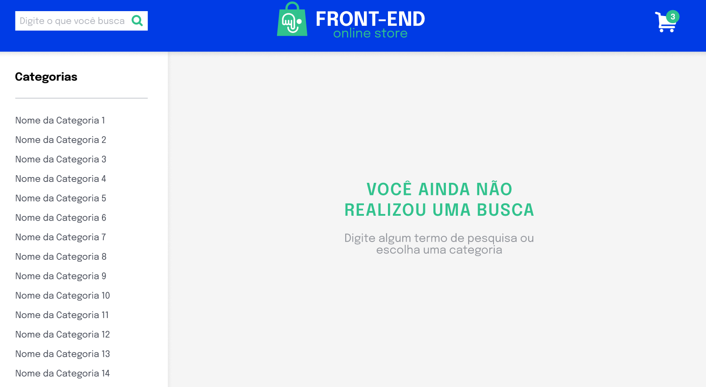
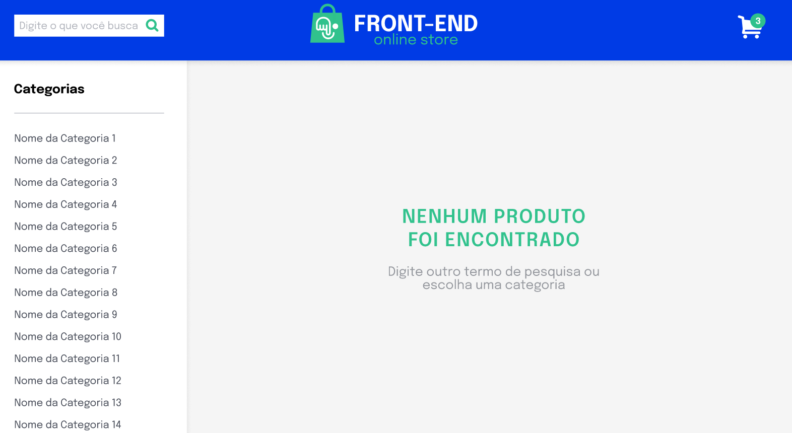
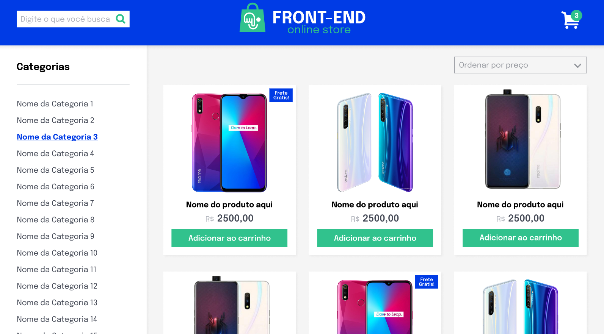
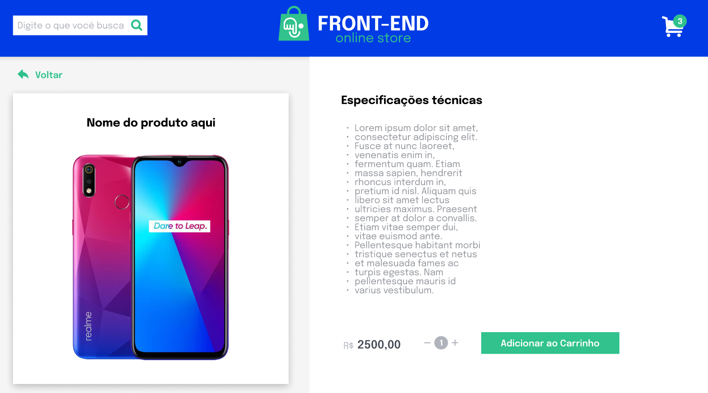
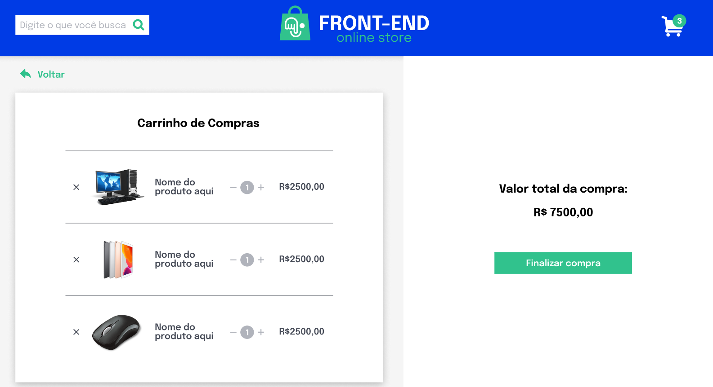
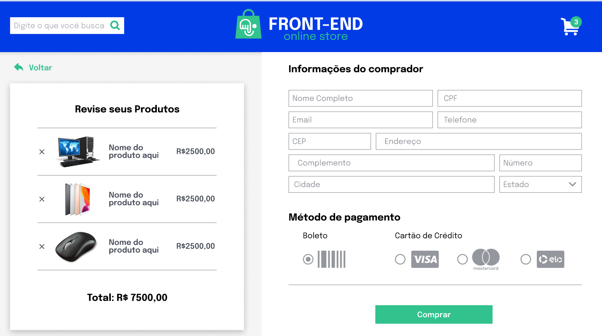

# Boas-vindas ao repositório do Projeto Store Manager!

Seja muito bem-vindo(a) ao repositório do Projeto Store Manager Aqui você encontrará informações sobre o que foi desenvolvido neste projeto, bem como os principais aprendizados adquiridos durante o processo, para adquirir esse conhecimento, basta clicar na seta abaixo que o conteúdo se abrirá, boa leitura, espero que goste. 🙂

 

  
<strong>👨‍💻 O que foi desenvolvido</strong>

Eu desenvolvi a minha primeira API utilizando a arquitetura MSC (model-service-controller)!

A API que foi construida é um sistema de gerenciamento de vendas no formato dropshipping em que será possível criar, visualizar, deletar e atualizar produtos e vendas. Você deverá utilizar o banco de dados MySQL para a gestão de dados. Além disso, a API é um RESTful.

   

  
<strong>👨O que eu aprendi</strong>

por mais que utilizamos uma api, este projeto feito em grupo desenvolveu muito mais nossas soft-skills do que nossas hard-skills

 
Trabalhando em Grupo com esse projeto utilizando uma API e Arquitetura MSC: Foi uma Experiência de Colaboração e Eficiência

Durante o desenvolvimento do nosso projeto, tivemos a oportunidade de trabalhar em equipe e utilizar uma API com a arquitetura Model-Service-Controller (MSC). Essa experiência proporcionou uma colaboração eficaz e permitiu a criação de um sistema bem estruturado e modular.

A arquitetura MSC nos proporcionou uma separação clara das responsabilidades e funções de cada componente do sistema. O Model ficou responsável pela representação dos dados e pelas operações de persistência. O Service concentrou a lógica de negócios e o controle do fluxo das operações. Por fim, o Controller gerenciou as requisições e respostas, interagindo diretamente com a API.

A utilização dessa arquitetura trouxe benefícios significativos para o nosso trabalho em grupo. A clareza na divisão de tarefas e responsabilidades permitiu que cada membro do time pudesse focar em sua área de atuação, maximizando a eficiência e evitando conflitos de código. Além disso, a modularidade proporcionada pela arquitetura MSC nos permitiu desenvolver e testar cada componente de forma independente, facilitando a detecção e correção de erros.

A colaboração foi um dos pilares do nosso sucesso. Através de reuniões regulares e comunicação constante, conseguimos alinhar as estratégias, compartilhar conhecimento e resolver desafios em conjunto. A troca de ideias e a contribuição de cada membro do grupo foram fundamentais para o crescimento individual e coletivo.

Trabalhar com uma API utilizando a arquitetura MSC exigiu disciplina e organização. A definição clara de interfaces e contratos facilitou a integração entre os diferentes componentes do sistema, garantindo uma comunicação eficiente. Além disso, a documentação detalhada dos endpoints e dos modelos de dados possibilitou uma compreensão rápida e precisa do funcionamento da API, agilizando o desenvolvimento e facilitando futuras manutenções.

Em suma, a experiência de trabalhar em grupo com uma API utilizando a arquitetura MSC foi gratificante e enriquecedora. A colaboração, a eficiência e a organização proporcionadas por essa abordagem foram essenciais para o sucesso do nosso projeto. Aprendemos não apenas sobre a tecnologia utilizada, mas também sobre a importância da comunicação, da colaboração e do trabalho em equipe.

Estamos orgulhosos do resultado alcançado e confiantes de que as habilidades adquiridas durante esse processo nos tornaram desenvolvedores mais completos e preparados para enfrentar desafios futuros. Continuaremos buscando novas oportunidades de aprendizado e crescimento, sempre valorizando a colaboração e a excelência na criação de sistemas de qualidade.

Juntos, conquistamos grandes resultados.

   

 

 

 

 

 

 

